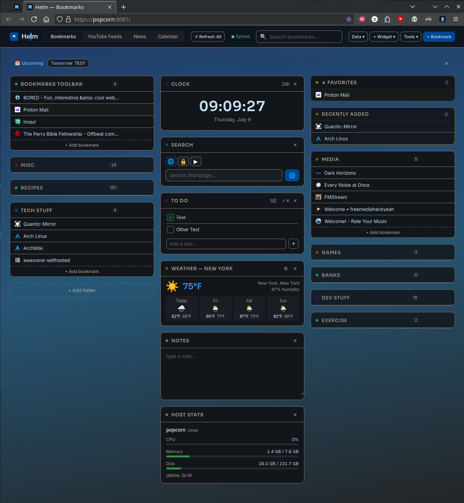
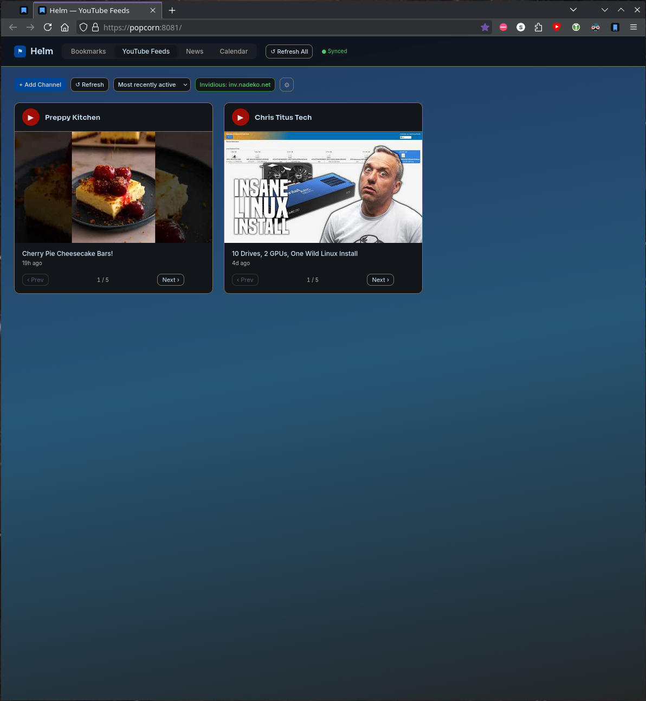
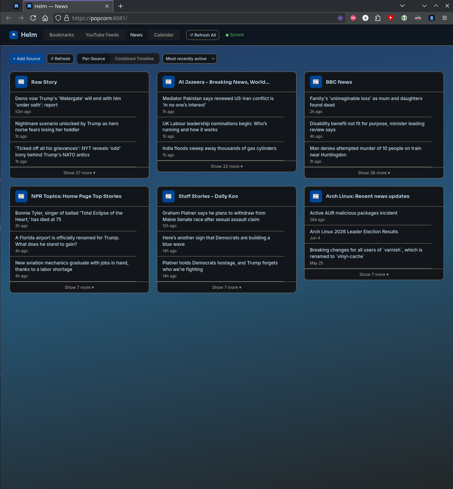
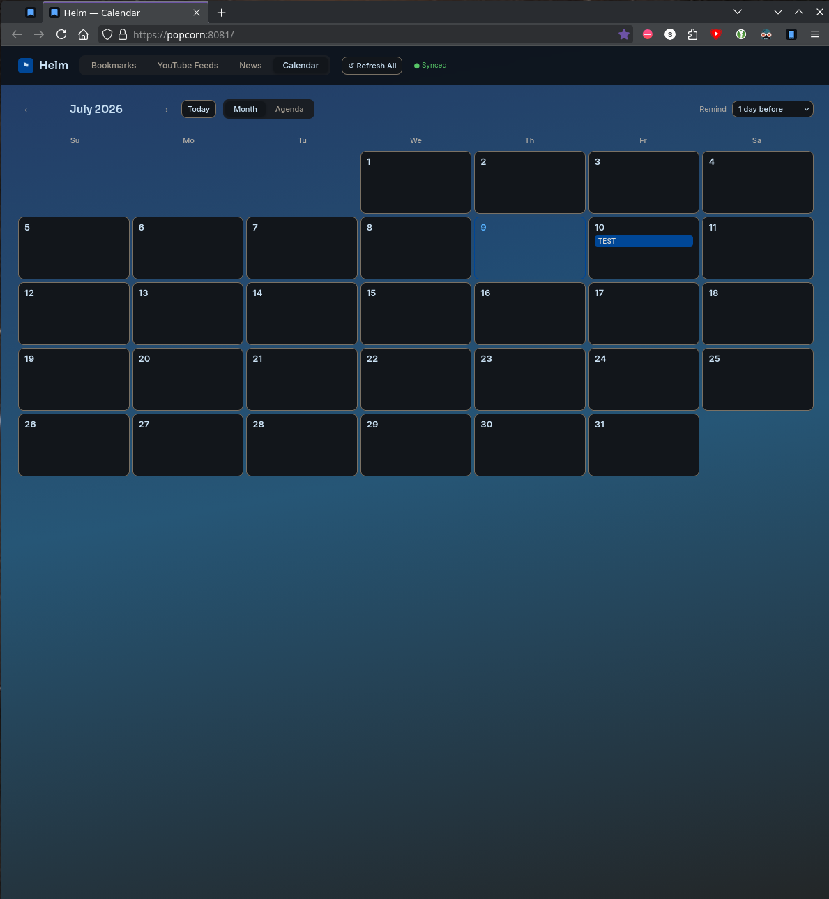

# Helm

A self-hosted personal dashboard. Bookmarks, YouTube feeds, calendar, news feeds, widgets, and multi-device sync — served by a lightweight Python backend.

---

## Screenshots






---

## Features

- **Bookmarks** - folders, drag-and-drop reordering, favorites, recently added, search, import/export (Netscape HTML and JSON), pin to favorites
- **YouTube Feeds** - add channels by ID or handle, video carousel per channel, Invidious support, sort by manual/alphabetical/recently active
- **News Feeds** - RSS 2.0 and Atom sources, per-source cards and a combined chronological timeline, auto-detection of feed URL from a site URL
- **Calendar** - calendar page with event scheduler and configurable reminder
- **Widgets** - search (Startpage, priv.au, YouTube), weather (Open-Meteo, no API key), notes, digital clock, system resource monitor
- **Multi-device sync** - the Python backend is the canonical store; changes push and pull silently across all devices on the network
- **Rolling backups** - the server automatically snapshots state on every save, keeping the 10 most recent
- **Encrypted config export** - AES-256-GCM via the browser's Web Crypto API; no external library
- **In-app article reader** - click any news headline to open a clean reader pane without leaving the page
- **HTTPS** - auto-detected from `cert.pem` / `key.pem` next to the server script
- **Browser extension** - save any page to Helm from the toolbar, with folder selection and already-bookmarked indicator

---

## Requirements

- Python 3.8 or later (standard library only — no pip dependencies)
- A modern browser (tested only on Waterfox)

---

## File Structure

```
helm/
├── index.html          # The entire frontend — one file
├── helm_server.py     # Python backend: static files, feed proxy, state sync
├── manifest.json       # PWA manifest
├── sw.js               # Service worker (offline app shell cache)
├── icon-192.png        # PWA icon
├── icon-512.png        # PWA icon
├── helm-extension/     # Firefox browser extension
│   ├── manifest.json
│   ├── background/
│   ├── popup/
│   ├── content/
│   └── icons/
├── cert.pem            # TLS certificate (not committed — generate locally)
├── key.pem             # TLS private key (not committed — generate locally)
└── helm_state.json    # Live state database (not committed — created at runtime)
```

---

## Quick Start

```bash
git clone git@github.com:quantic-mirror/helm.git
cd helm
python3 helm_server.py 8080
```

Open `http://localhost:8080` in your browser.

---

## HTTPS Setup (required for encrypted export and multi-device use)

Generate a local certificate authority and a server certificate signed by it:

```bash
# Create your local CA (do this once)
openssl genrsa -out helm-ca.key 2048
openssl req -x509 -new -nodes -key helm-ca.key -sha256 -days 3650 \
  -out helm-ca.crt -subj "/CN=Helm Local CA"

# Generate the server certificate
openssl genrsa -out key.pem 2048
openssl req -new -key key.pem -out helm.csr -subj "/CN=popcorn"

# Write the extension config (replace IP and hostname to match your server)
cat > /tmp/helm-ext.cnf << 'EOF'
subjectAltName=IP:IP_ADDRESS_OF_SERVER,DNS:HOSTNAME_OF_SERVER,DNS:localhost
basicConstraints=CA:FALSE
keyUsage=digitalSignature,keyEncipherment
extendedKeyUsage=serverAuth
EOF

# Sign with your CA
openssl x509 -req -in helm.csr \
  -CA helm-ca.crt -CAkey helm-ca.key -CAcreateserial \
  -out cert.pem -days 365 -sha256 -extfile /tmp/helm-ext.cnf
```

Place `cert.pem` and `key.pem` next to `helm_server.py`. The server detects them automatically and starts in HTTPS mode.

Import `helm-ca.crt` into your browser on each device:
- **Firefox / Waterfox desktop**: Settings → Search "cert" → View Certificates → Authorities → Import → check "Trust this CA to identify websites"
- **Firefox / Waterfox Android**: Install `helm-ca.crt` into Android via Settings → Security → Install a certificate, then in Waterfox go to `about:config` and set `security.enterprise_roots.enabled` to `true`

---

## Running as a systemd User Service (Linux)

Create `~/.config/systemd/user/helm.service`:

```ini
[Unit]
Description=Helm dashboard server
After=network.target

[Service]
WorkingDirectory=/home/youruser/helm
ExecStart=/usr/bin/python3 helm_server.py 8080
Restart=on-failure
RestartSec=5
StartLimitIntervalSec=60
StartLimitBurst=5

[Install]
WantedBy=default.target
```

Enable and start it:

```bash
systemctl --user daemon-reload
systemctl --user enable --now helm.service
```

---

## Browser Extension

The `helm-extension/` folder contains a Firefox extension that adds a toolbar button to save the current page directly to Helm, with folder selection and a duplicate-detection indicator.

To install without the extension store, load it temporarily via `about:debugging` → This Firefox → Load Temporary Add-on → select `manifest.json`.

For a permanent install, submit the zip to [addons.mozilla.org](https://addons.mozilla.org) as a self-distributed (unlisted) add-on to get it signed without a public listing.

---

## API Endpoints

The backend exposes several endpoints alongside serving the static files:

| Endpoint | Method | Description |
|---|---|---|
| `/api/health` | GET | Returns `{"status":"ok"}` — used by the frontend to detect the backend |
| `/api/state` | GET / PUT | Read or write the full dashboard state (last-write-wins) |
| `/api/proxy?url=` | GET | CORS proxy for RSS/Atom feed fetching |
| `/api/sysstats` | GET | Host CPU, memory, disk, and uptime for the Sys Stats widget |
| `/api/backups` | GET | List of rolling backup snapshots |
| `/api/backups/<file>` | GET | Download a specific backup snapshot |

---

## Multi-Device Sync

The server holds the canonical state in `helm_state.json`. Every device pulls the server state on page load and pushes any local changes within 600 ms of a save. The polling interval is 5 seconds. Sync is silent — no dialogs, no conflict prompts. Last write wins.

---

## To-Do

Fix config restore not restoring News Feeds


---

## License

MIT
