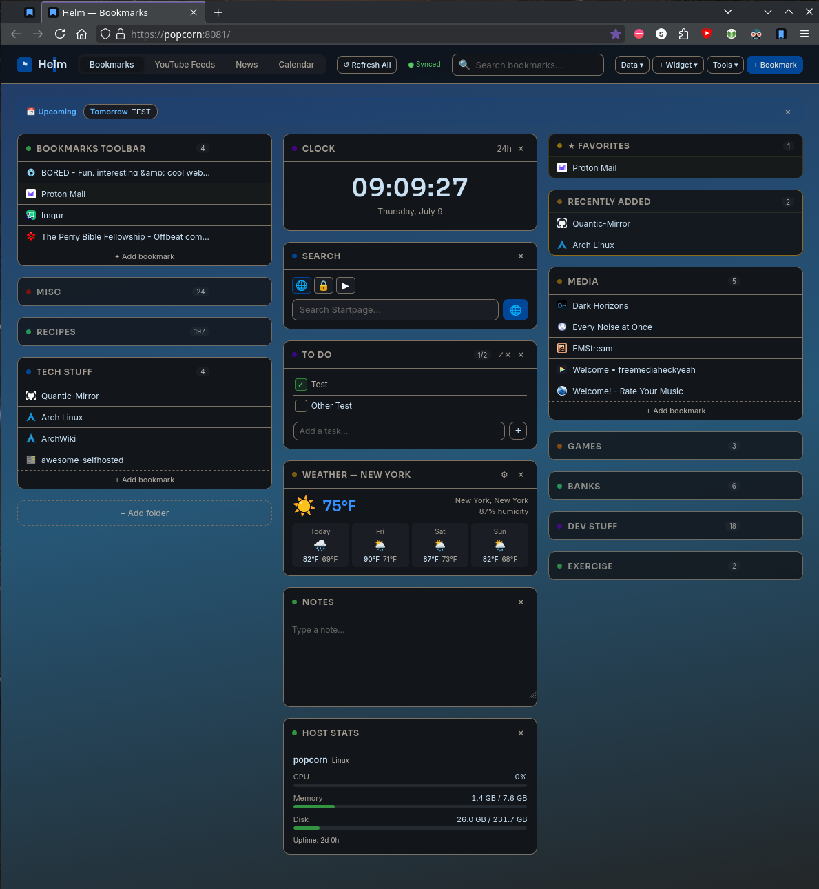
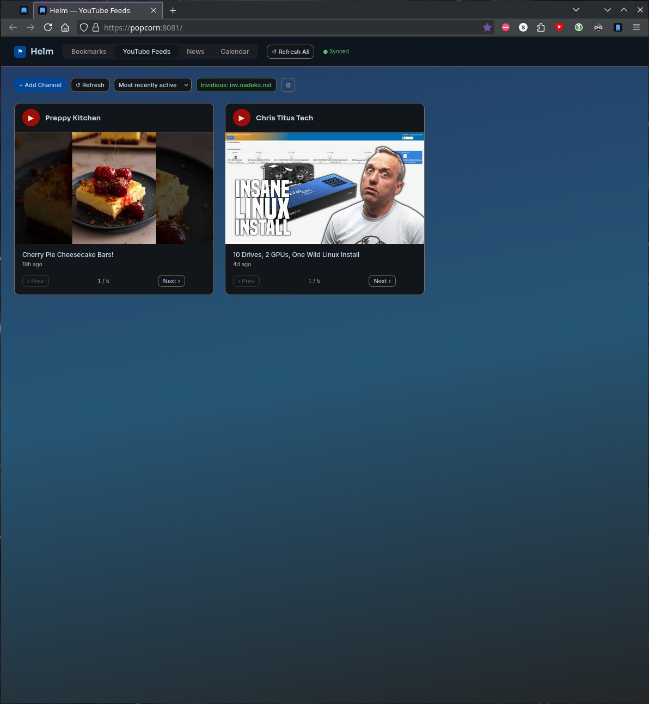
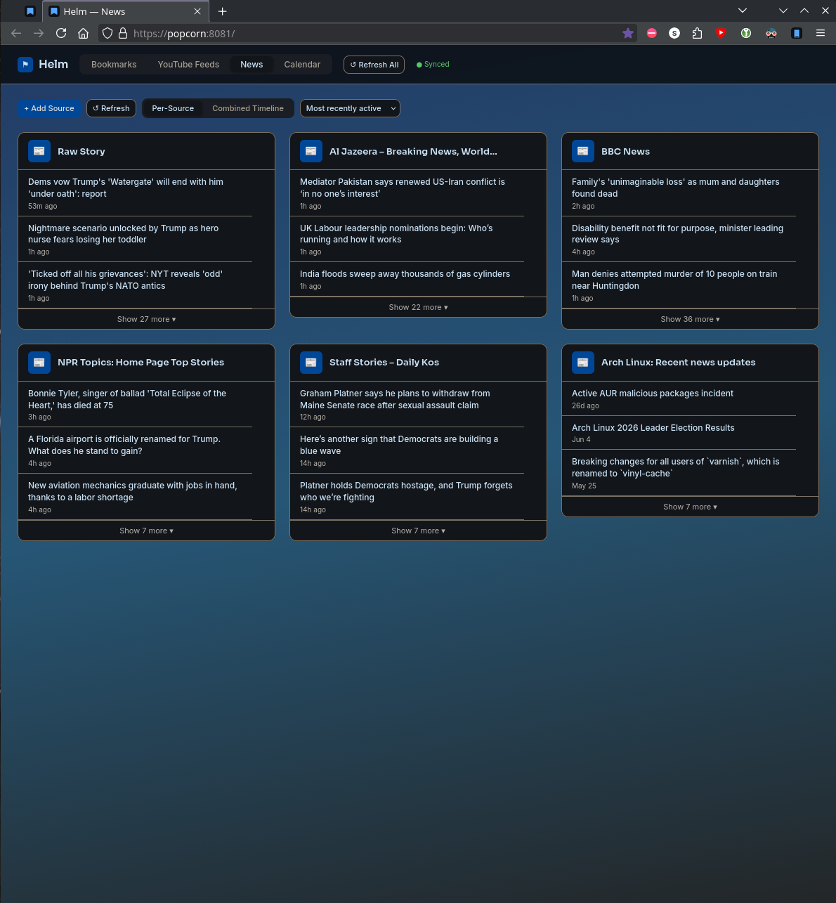
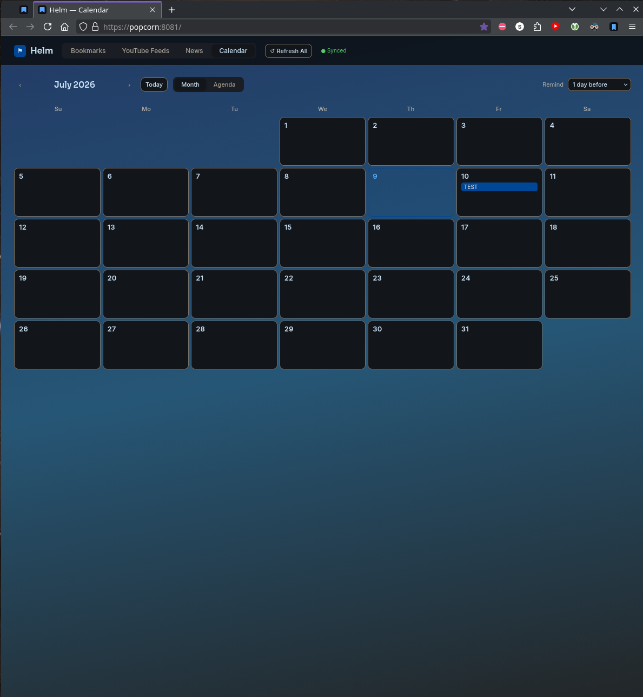

# Helm

A self-hosted personal dashboard. Bookmarks, YouTube feeds, calendar, news feeds, widgets, and multi-device sync — served by a stdlib-only Python backend. Runs bare-metal or in a container (see [CONTAINER_SETUP.md](CONTAINER_SETUP.md)).

---

## Screenshots






---

## Features

- **Bookmarks** - folders, drag-and-drop reordering, favorites, recently added, search, import/export (Netscape HTML and JSON), pin to favorites
- **YouTube Feeds** - add channels by ID or handle, video carousel per channel, Invidious support, sort by manual/alphabetical/recently active
- **News Feeds** - RSS 2.0 and Atom sources, per-source cards and a combined chronological timeline, auto-detection of feed URL from a site URL
- **Calendar** - event scheduler with configurable reminders
- **Workout tracker** - log sessions and exercises
- **Audio Grabber** - download audio from a URL via yt-dlp (runs on a separate host, proxied through `/api/audio/*`)
- **Backup Pipeline** - observability for external backup jobs; scripts POST status events to `/api/backup-events`, shown as per-stage status lights and a live event feed
- **Services page** - status of the sibling Docker containers (`helm`, `searxng-core`), with start/stop/restart for the controllable ones
- **Log viewer** - realtime `docker logs` for the monitored services, filterable per service, error/warning/info levels
- **Multi-device sync** - the Python backend is the canonical store; changes push and pull silently across all devices on the network
- **Rolling backups** - the server automatically snapshots state on every save, keeping the 10 most recent
- **Encrypted config export** - AES-256-GCM via the browser's Web Crypto API; no external library
- **In-app article reader** - click any news headline to open a clean reader pane without leaving the page
- **HTTPS** - auto-detected from `cert.pem` / `key.pem` in the state dir
- **Browser extension** - save any page to Helm from the toolbar, with folder selection and already-bookmarked indicator
- **Weather widget**
- **On This Day Widget** - random fact for the current date with link to article
- **Sun & Moon Widget**
- **To-Do Widget**
- **Clock / Timer Widget**
- **Search Widget** - Search via SearXNG (containerized alongside Helm), Startpage, YouTube
- **Notes Widget**
- **Random Wikipedia Article Widget**
- **SomaFM Now Playing / Lyrics Widgets** - current track on a SomaFM channel, with lyrics lookup
- **Host Stats Widget** - Shows CPU, Memory, Disk usage
- **Quote Of The Day Widget**


---

## Requirements

- Python 3.8 or later (standard library only — no pip dependencies)
- A modern browser (tested only on Waterfox)

---

## File Structure

```
helm/
├── index.html              # The entire frontend — one file
├── helm_server.py          # Python backend: static files, feed proxy, state sync,
│                           #   service/log monitoring, vault + audio proxies
├── vault_server.py         # Standalone pass-backed password vault (runs on a separate host)
├── vault_api.py            #   its request logic
├── audio_grabber_server.py # Standalone yt-dlp audio downloader (runs on a separate host)
├── emit_event.py           # CLI used by external backup scripts to POST to /api/backup-events
├── helm_tls_proxy.py       # Generic TLS reverse proxy for iframed apps (currently unused)
├── manifest.json           # PWA manifest
├── sw.js                   # Service worker (offline app shell cache)
├── icon-192.png            # PWA icon
├── icon-512.png            # PWA icon
├── helm-extension/         # Firefox browser extension
│   └── manifest.json + background/ popup/ content/ icons/
├── Dockerfile.helm         # Container image (code baked in)
├── docker-compose.yml      # helm + searxng services
├── CONTAINER_SETUP.md      # Container / VPS deployment guide
└── data/                   # State dir (not committed — created at runtime):
    ├── marks_state.json    #   live state database
    ├── helm-backups/       #   rolling snapshots
    ├── backup_events.json  #   backup-pipeline event feed
    ├── cert.pem / key.pem  #   TLS (generate locally; enables HTTPS)
    └── *_token.txt         #   shared secrets for the vault / audio / backup endpoints
```

> The state dir is `data/` under the container bind-mount, or the directory
> containing `helm_server.py` when run bare-metal — set explicitly with
> `HELM_STATE_DIR`.

---

## Quick Start

### Bare-metal

```bash
git clone git@github.com:Quantic-Mirror/Helm.git
cd Helm
python3 helm_server.py 8080
```

Open `http://localhost:8080` in your browser. State is written next to
`helm_server.py` unless `HELM_STATE_DIR` is set.

### Container

```bash
git clone git@github.com:Quantic-Mirror/Helm.git
cd Helm
cp .env.example .env      # then edit — see CONTAINER_SETUP.md
docker compose up -d
```

The code is baked into the image; mutable state lives in `./data`. Full
walkthrough (Tailscale / public modes, the separate vault + audio hosts, the
backup token) in [CONTAINER_SETUP.md](CONTAINER_SETUP.md).

---

## HTTPS Setup (required for encrypted export and multi-device use)

Generate a local certificate authority and a server certificate signed by it:

```bash
# Create your local CA (do this once)
openssl genrsa -out helm-ca.key 2048
openssl req -x509 -new -nodes -key helm-ca.key -sha256 -days 3650 \
  -out helm-ca.crt -subj "/CN=Helm Local CA"

# Generate the server certificate (CN = the hostname or IP you'll reach Helm at)
openssl genrsa -out key.pem 2048
openssl req -new -key key.pem -out helm.csr -subj "/CN=your-server"

# Write the extension config (replace IP and hostname to match your server)
cat > /tmp/helm-ext.cnf << 'EOF'
subjectAltName=IP:IP_ADDRESS_OF_SERVER,DNS:HOSTNAME_OF_SERVER,DNS:localhost
basicConstraints=CA:FALSE
keyUsage=digitalSignature,keyEncipherment
extendedKeyUsage=serverAuth
EOF

# Sign with your CA
openssl x509 -req -in helm.csr \
  -CA helm-ca.crt -CAkey helm-ca.key -CAcreateserial \
  -out cert.pem -days 365 -sha256 -extfile /tmp/helm-ext.cnf
```

Place `cert.pem` and `key.pem` in the state dir (next to `helm_server.py` bare-metal, or `./data` for the container). The server detects them automatically and starts in HTTPS mode.

For a container on a VPS reached over Tailscale, a self-signed cert with `CN=<Tailscale-IP>` is enough — see [CONTAINER_SETUP.md](CONTAINER_SETUP.md).

Import `helm-ca.crt` into your browser on each device:
- **Firefox / Waterfox desktop**: Settings → Search "cert" → View Certificates → Authorities → Import → check "Trust this CA to identify websites"
- **Firefox / Waterfox Android**: Install `helm-ca.crt` into Android via Settings → Security → Install a certificate, then in Waterfox go to `about:config` and set `security.enterprise_roots.enabled` to `true`

---

## Running as a systemd User Service (Linux)

For a bare-metal install. The container path (`docker compose up -d`, with
`restart: unless-stopped`) is described in [CONTAINER_SETUP.md](CONTAINER_SETUP.md).

Create `~/.config/systemd/user/helm.service`:

```ini
[Unit]
Description=Helm dashboard server
After=network.target

[Service]
WorkingDirectory=/home/youruser/helm
ExecStart=/usr/bin/python3 helm_server.py 8080
Restart=on-failure
RestartSec=5
StartLimitIntervalSec=60
StartLimitBurst=5

[Install]
WantedBy=default.target
```

Enable and start it:

```bash
systemctl --user daemon-reload
systemctl --user enable --now helm.service
```

---

## Browser Extension

The `helm-extension/` folder contains a Firefox extension that adds a toolbar button to save the current page directly to Helm, with folder selection and a duplicate-detection indicator.

To install without the extension store, load it temporarily via `about:debugging` → This Firefox → Load Temporary Add-on → select `manifest.json`.

For a permanent install, submit the zip to [addons.mozilla.org](https://addons.mozilla.org) as a self-distributed (unlisted) add-on to get it signed without a public listing.

---

## API Endpoints

The backend exposes several endpoints alongside serving the static files:

| Endpoint | Method | Description |
|---|---|---|
| `/api/health` | GET | `{"status":"ok","service":"marks-local-server"}` — frontend backend-detection probe |
| `/api/state` | GET / PUT | Read or write the full dashboard state (last-write-wins) |
| `/api/config` | GET | Runtime hostnames/URLs (`SERVER_HOST`, `searxng_url`, …) so the frontend hardcodes nothing |
| `/api/proxy?url=` | GET | CORS proxy for RSS/Atom feed fetching (`http`/`https` only) |
| `/api/sysstats` | GET | Host CPU, memory, disk, and uptime for the Host Stats widget |
| `/api/network` | GET | Private/public IPv4 & IPv6 for the Services page network card |
| `/api/backups` | GET | List of rolling state snapshots |
| `/api/backups/<file>` | GET | Download one snapshot (path-traversal guarded) |
| `/api/services` | GET | Status of the monitored Docker containers |
| `/api/services/<id>` | POST | `{"action":"start\|stop\|restart"}` for a controllable service |
| `/api/logs?service=` | GET | Merged `docker logs` for the monitored services, newest first |
| `/api/backup-events` | GET | Backup-pipeline event feed (`{events, updated_at}`) |
| `/api/backup-events` | POST | Ingest one event — requires `X-Backup-Token` (see `emit_event.py`) |
| `/api/vault/*` | GET / POST | Proxied to `vault_server.py` on the vault host (shared-token auth) |
| `/api/audio/*` | GET / POST | Proxied to `audio_grabber_server.py` on the audio host (shared-token auth) |

---

## Multi-Device Sync

The server holds the canonical state in `marks_state.json` (in the state dir). Every device pulls the server state on page load and pushes any local changes within 600 ms of a save. The polling interval is 5 seconds. Sync is silent — no dialogs, no conflict prompts. Last write wins.

---

## To-Do

Fix config restore not restoring News Feeds


---

## License

MIT
